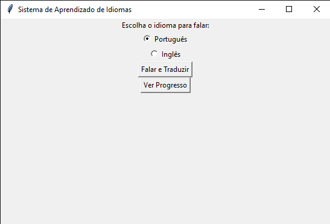
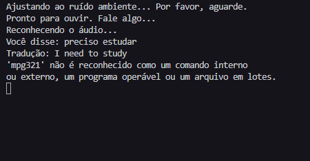

# Sistema de Aprendizado de Idiomas com Reconhecimento de Voz e Tradução
## Este é um sistema simples de aprendizado de idiomas que utiliza reconhecimento de voz para capturar a fala do usuário, traduz o texto capturado para outro idioma e fornece feedback auditivo através da conversão do texto traduzido em fala. Além disso, o sistema possui uma interface gráfica para facilitar a interação e um banco de dados para armazenar o progresso do usuário.


  


## Funcionalidades:
Captura de áudio do microfone e transcrição para texto utilizando a biblioteca speech_recognition.
Tradução do texto transcrito para outro idioma utilizando a API do Google através da biblioteca googletrans.
Conversão do texto traduzido em fala para fornecer feedback auditivo usando a biblioteca gtts.
Interface gráfica (GUI) simples criada com tkinter para seleção de idioma e controle das funcionalidades.
Armazenamento do progresso do usuário em um banco de dados SQLite para acompanhamento futuro.

## Pré-requisitos:
> Python 3.x instalado.

## Instalação das bibliotecas necessárias:

```bash
pip install SpeechRecognition
pip install googletrans==4.0.0-rc1
pip install gtts
pip install tkinter
```

## Como Executar:
Clone o repositório:
```bash
git clone 
cd 
```
## Execute o script:
```bash
python app.py
```

